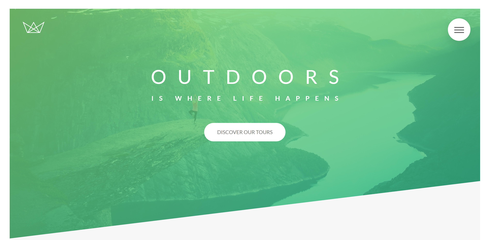
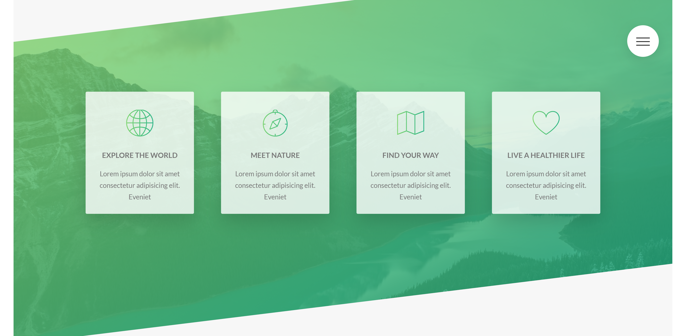
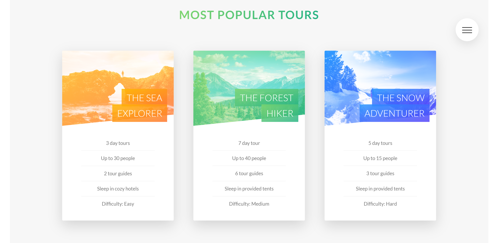
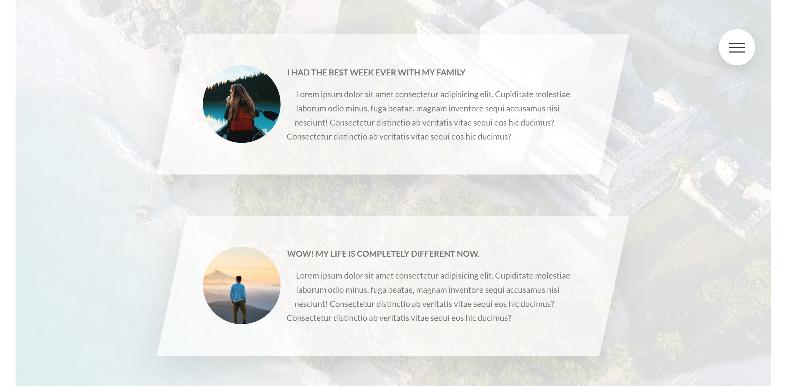
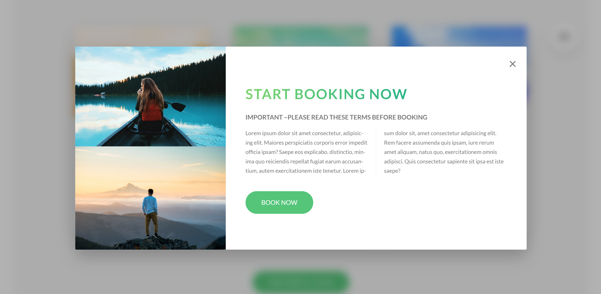
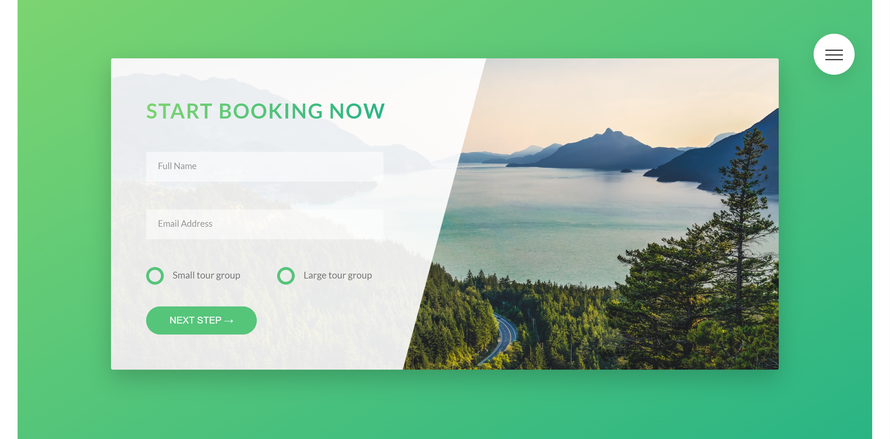

# Natours

This is a fully responsive landing page for a fictional tour website. The themes are centered around nature and finding inspiration in touring beautiful places around the world.

## Link

Check it out here:

## Screenshots

 

 

 

 

 

 

 

## Description

I developed this website using Jonas Schmedtmann's Advanced CSS and SASS course to improve my CSS skills and to better familiarize myself with SASS and the SCSS syntax. I employ all SASS and CSS best practices and utilize variables, mixins, partials, and more. I also optimized my build by compressing the CSS and configuring responsive images.

## Features

This page features an animated mobile menu with unique hover effects and slide-in text. Each section is marked by an animated heading and an angular design, which is thematically reflected in other areas of the page. Gradients were utilized over the top of images to portray color and personality. In addition, I used a background video in one section to give it more of a unique feature. I made custom radio buttons for the form to personalize it and better fit the overall theme. This website is also fully responsive and images were made responsive to increase overall performance on mobile devices.

## Technology

HTML
 
CSS
 
SASS/SCSS
 
Mobile responsiveness
 
npm autoprefixer, concat, npm-run-all, postcss, postcss-cli (to prefix, compile, and compress all CSS)

## Questions:

Feel free to contact me at mully7773@gmail.com if you have any questions.  
You can view more of my projects at https://github.com/Mully7773.
